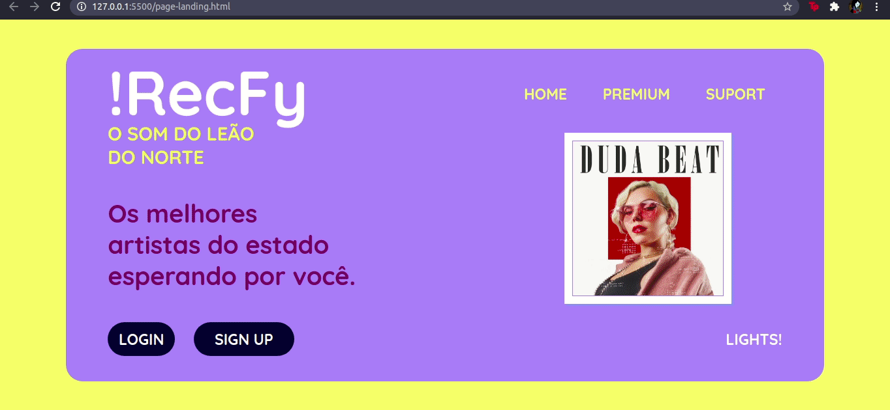
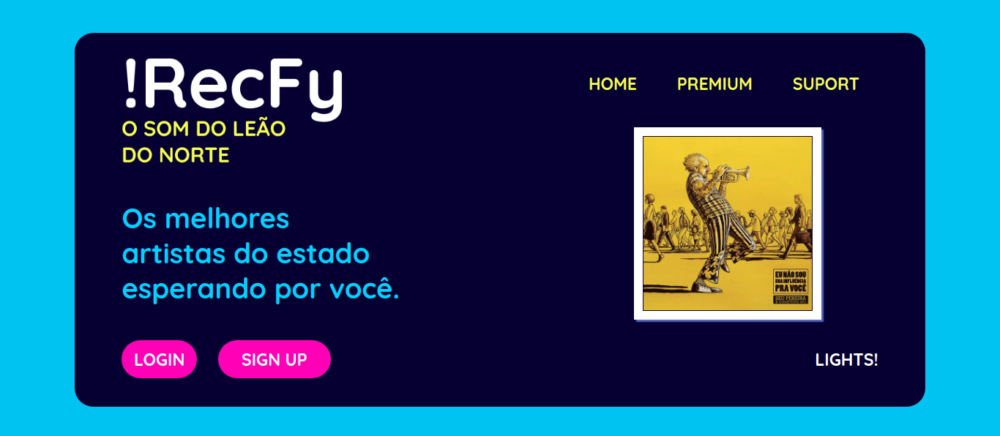
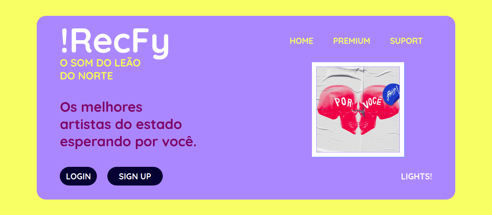

<h1 align="center">
 
    
 
 
RecFy
</h1>

A music stream plataform for Pernambuco

    
    
    

## Features

- **JavaScript**
- **HTML**
- **CSS**

## Getting started

### You can use or modify this project yoursel following typing this code in your terminal: $ git clone https://github.com/vallegabrielle/recfy.git